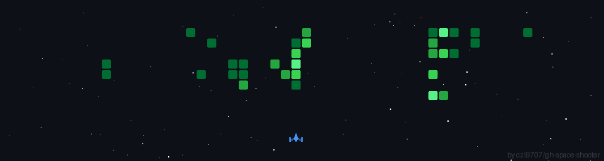

<h1>👋 Hi, I’m @danielduncan</h1>
<ul>
  <li>👀 I’m interested in topics at the intersection of science and technology - in particular quantum devices and computing. I'm also interested in cryptography (homomorphic encryption, zero-knowledge proofs), and dabble in machine learning.</li>
  <li>🌱 I’m currently completing my honours degree in physics.</li>
  <li>💞️ I’m looking to collaborate on quantum computing projects (algorithms, hardware, or in-between).</li>
  <li>📫 You can contact me at danieljzduncan@gmail.com.</li>
</ul>

<!---
danielduncan/danielduncan is a ✨ special ✨ repository because its `README.md` (this file) appears on your GitHub profile.
You can click the Preview link to take a look at your changes.
--->
